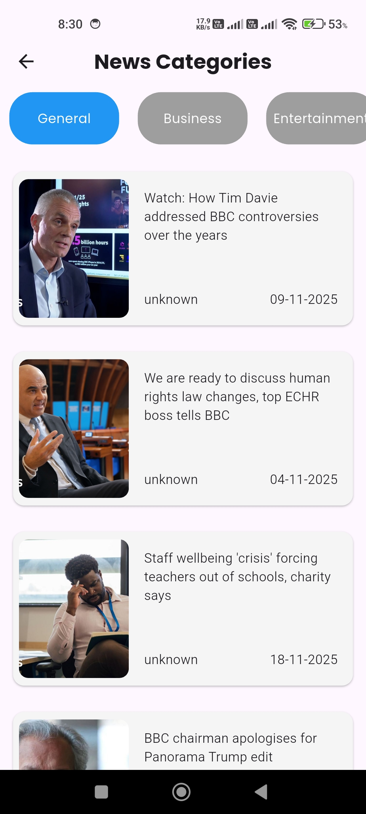

Flutter News App

A simple and clean news application built with Flutter. This project focuses on understanding API integration, JSON parsing, and state management using Provider.

---

✅ Features

Fetch latest news from an online API

Display news articles in a scrollable list

Show news details with images and descriptions

Smooth and responsive UI

Learn API handling, models, and Provider state management

---

📸 Screenshot

 

    
    
    
 

---

📌 Notes

This project was created for learning purposes.

All code is manually written with full understanding of API integration and models.

Future plans: search functionality, offline mode, and improved UI.

---

🧑‍💻 Author

Sameer Asghar
GitHub Profile
